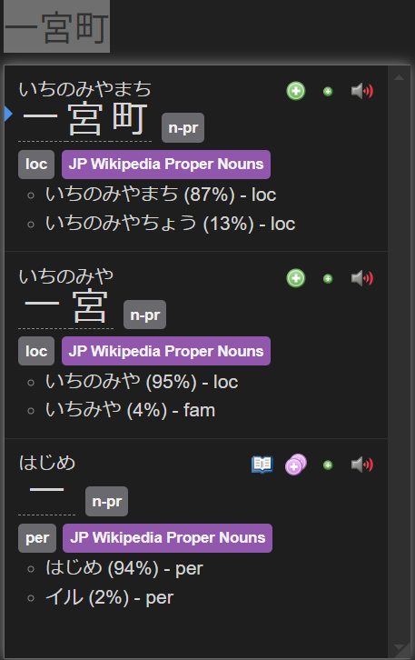

# Yomitan Pop-up Dictionary for Japanese Proper Nouns

Welcome to the Yomitan Pop-up Dictionary! This dictionary is focused on Japanese proper nouns. It was put together by scraping the Japanese Wikipedia to bring you the ~10,000 most commonly used proper nouns.

The dictionary is based on an Anki deck originally created by an anon who pulled all these proper nouns from Wikipedia. You can check out the original deck [here on AnkiWeb](https://ankiweb.net/shared/info/3885156604).

## Version

Current Version: 1.0.0

## What’s Included

- **10,000+ Proper Nouns**: This covers everything from place names to people’s names and more. Super useful if you’re reading Japanese texts and want a quick lookup!
- **Made for Yomitan**: It’s set up to work perfectly with Yomitan, the pop-up dictionary tool. Just hover over a word, and you’ll get instant info on all these proper nouns.

## How to Use

1. Download the dictionary file from this repo.
2. Add it to Yomitan following [Yomitan's guide ](https://yomitan.wiki/).
3. Start reading and see the pop-up definitions for proper nouns!

## Example in Action

Check out what it looks like:

  
*In this screenshot, the dictionary shows proper nouns like "一宮町" (Ichinomiya Town) and "はじめ" (Hajime), along with their meanings and usage breakdowns.*

## Where’s the Data From?

The data comes from an Anki deck called "Japanese Proper Nouns". You can grab the original deck [here](https://ankiweb.net/shared/info/3885156604). If the anon who create the anki deck wants to be credited, please reach out!

## License

This project is public domain, just like the original Anki deck. Feel free to use, modify, and share it as you like—just remember to give credit where it's due!
